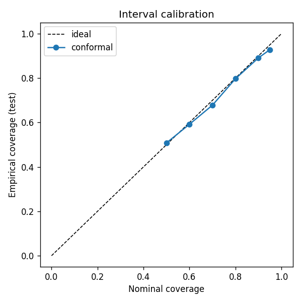
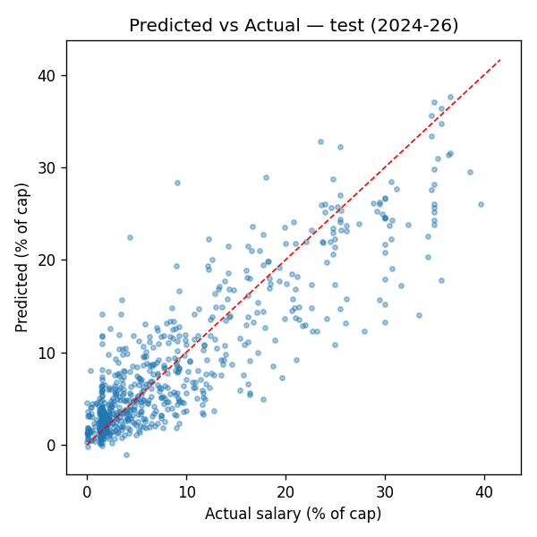

# Valuation model — v0 backtest

**Model:** `v0-gbm-conformal` (HistGradientBoosting + split-conformal intervals)  
**What it does:** estimates a player's **production-implied market value** (salary as % of cap) from on-court production. It is *not* given the player's current salary — so the prediction is what production says they're worth, and the gap to actual pay is the signal.  
**Framing:** features = production at season *t* → value at *t+1*, strict temporal split (no leakage). Train target-seasons ≤ 2023-24 (4321 rows, 1081 held out for conformal calibration); test ['2024-25', '2025-26'] (699 rows).

_Note: the newest test season's actual pay is the per-season contract cap hit (Spotrac-sourced), since realized box-score salary tables lag a year. This is the same pay figure the live product compares against, and it is used for evaluation only — never as a training target._

## Headline metrics (test 2024-26)
| Metric | Value |
|---|---|
| MAE | **3.128% of cap** (~$4,592,615) |
| R² | **0.767** |
| Naive (predict mean) MAE | 6.98% of cap |
| 80% interval coverage | **0.797** (target 0.80) |
| 80% interval half-width | ±4.85% of cap |

Production alone explains **R²=0.767** of pay and cuts error to 3.128% vs 6.98% for a mean-predictor — i.e. how much salary is driven by production.

## Honest caveat: salary stickiness
A persistence reference (predict next pay = *current* salary, which we deliberately **exclude** as a feature) scores 2.146% MAE on the 678 mid-contract test players — better than this model on those rows. That's expected: their pay is contractually locked, not a production signal. We exclude current salary on purpose so the model answers *worth*, not *what's already on the books*. The v1 upgrade (contract-AAV target via Spotrac) evaluates at contract-decision points directly.

## Bargains & overpays (test set)
Largest gaps between production-implied value and actual pay — the actionable output.

**Most underpaid (production worth more than pay):**
| Player | Season | Value (% cap) | Actual pay (% cap) | Gap |
|---|---|---|---|---|
| Damian Lillard | 2025-26 | 28.4 | 9.12 | +19.28 |
| Jalen Williams | 2025-26 | 22.42 | 4.26 | +18.16 |
| Russell Westbrook | 2025-26 | 14.09 | 1.48 | +12.6 |
| Bradley Beal | 2025-26 | 15.71 | 3.46 | +12.25 |
| Tobias Harris | 2024-25 | 28.92 | 18.04 | +10.88 |
| Jalen Williams | 2024-25 | 14.13 | 3.4 | +10.73 |
| Spencer Dinwiddie | 2024-25 | 11.83 | 1.48 | +10.35 |
| Austin Reaves | 2025-26 | 19.35 | 9.01 | +10.34 |

**Most overpaid (paid more than production implies):**
| Player | Season | Value (% cap) | Actual pay (% cap) | Gap |
|---|---|---|---|---|
| Paul George | 2025-26 | 14.0 | 33.41 | -19.4 |
| Bradley Beal | 2024-25 | 17.76 | 35.71 | -17.95 |
| Anthony Edwards | 2024-25 | 13.24 | 30.0 | -16.76 |
| Ben Simmons | 2024-25 | 12.24 | 27.92 | -15.68 |
| Lauri Markkanen | 2025-26 | 15.2 | 30.0 | -14.8 |
| Zach LaVine | 2024-25 | 17.21 | 31.68 | -14.46 |
| LaMelo Ball | 2024-25 | 10.86 | 25.0 | -14.14 |
| Devin Booker | 2025-26 | 20.28 | 34.36 | -14.08 |

## Interval calibration
Conformal intervals are well-calibrated when empirical ≈ nominal.

| Nominal | Empirical | ± half-width (% cap) |
|---|---|---|
| 0.50 | 0.508 | 2.1 |
| 0.60 | 0.592 | 2.77 |
| 0.70 | 0.678 | 3.57 |
| 0.80 | 0.797 | 4.85 |
| 0.90 | 0.891 | 6.99 |
| 0.95 | 0.928 | 8.81 |

## Top features (permutation importance)
| Feature | Importance |
|---|---|
| pts_pg | 0.5527 |
| age | 0.2183 |
| tov_pg | 0.0253 |
| reb_pg | 0.0201 |
| ast_pg | 0.0200 |
| USG_PCT | 0.0159 |
| PIE | 0.0150 |
| NET_RATING | 0.0122 |
| minutes | 0.0074 |
| WS | 0.0069 |
| BPM | 0.0068 |
| OBPM | 0.0059 |
